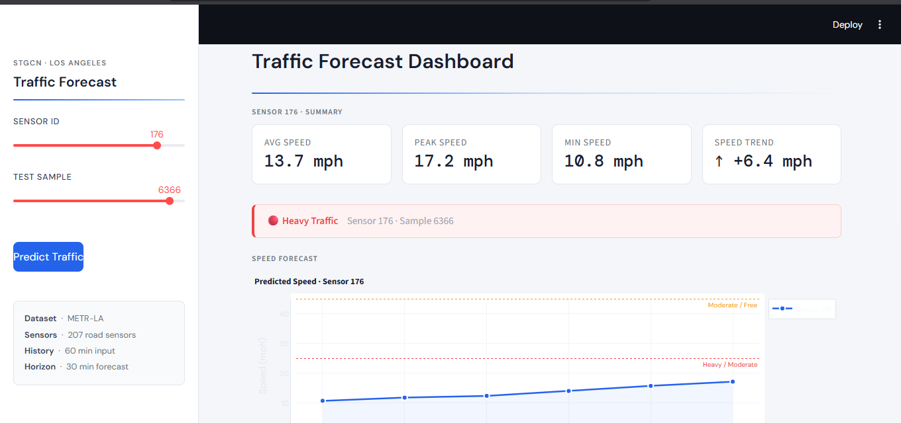

#  Traffic Speed Forecasting using STGCN

> Predicting urban traffic speeds across 207 road sensors using Spatio-Temporal Graph Convolutional Networks.

---

## Overview

This project implements a **Spatio-Temporal Graph Convolutional Network (STGCN)** to forecast future traffic speeds using historical sensor data from the **METR-LA dataset**.

The model jointly captures:
- **Spatial dependencies** between road segments via graph convolution
- **Temporal patterns** across time steps via temporal convolution

---

## Problem Statement

Predict traffic speed for the next **30 minutes** based on past observations from **207 road sensors** on the Los Angeles highway network (METR-LA dataset).

---

## Model Architecture

```
Input Sequence (T timesteps × 207 nodes)
        │
  ┌─────▼─────┐
  │ STGCN Block 1 │  ← Graph Conv (spatial) + Temporal Conv
  └─────┬─────┘
        │
  ┌─────▼─────┐
  │ STGCN Block 2 │  ← Graph Conv (spatial) + Temporal Conv
  └─────┬─────┘
        │
  ┌─────▼──────────┐
  │ Fully Connected │  ← Output layer
  └─────┬──────────┘
        │
  Predicted Speed (next 30 min)
```

Each STGCN block combines:
- **Graph Convolution** — propagates features across the road network adjacency graph
- **Temporal Convolution** — extracts time-series patterns with gated activation

---

## Tech Stack

| Component | Tool |
|-----------|------|
| Deep Learning | PyTorch |
| Data Processing | NumPy, Pandas |
| API Backend | FastAPI |
| Frontend UI | Streamlit |
| Containerization | Docker *(optional)* |

---

## Project Structure

```
STGCN_FINAL/
├── api/                # FastAPI backend (inference endpoint)
├── app/                # Streamlit UI (interactive dashboard)
├── notebooks/          # Experiments and training notebooks
├── assets/             # Screenshots and demo media
└── README.md
```

---

## Getting Started

### 1. Install Dependencies

```bash
pip install -r requirements.txt
```

### 2. Start the API

```bash
uvicorn api.api:app --reload
```

### 3. Launch the Streamlit App

```bash
streamlit run app/app.py
```

---

## Demo



The Streamlit dashboard includes an **interactive slider** that lets you scrub through `X_train` sequences in real time — demonstrating the model's ability to handle dynamic, changing inputs and produce live speed forecasts across the sensor network.

---

## Results

- Model successfully learns joint spatio-temporal dependencies across the road graph
- Produces smooth, realistic traffic speed forecasts over a 30-minute horizon
- Interactive demo validates generalization across varied input windows

---

## Notes

- Dataset not included due to size constraints — download METR-LA from the [official source](https://github.com/liyaguang/DCRNN)
- Model was trained and evaluated on the METR-LA benchmark
- Intractive slider to show live data using X_test.npm to show that model can also perform on dynamic data in streamlite
- you have to also set X_test.npm in your artifacts folder so that while runing streamlit doesnot give error 

---

## Future Improvements

- [ ] Integrate a real-time data ingestion pipeline
- [ ] Hyperparameter tuning for improved MAE/RMSE
- [ ] Live cloud deployment (AWS / GCP)
- [ ] Extend to multi-step forecasting horizons (60 min, 120 min)

---
## License

This project is for academic purposes only.
